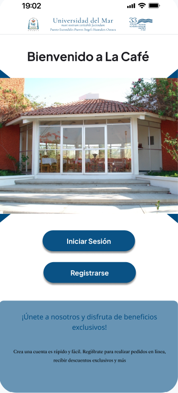
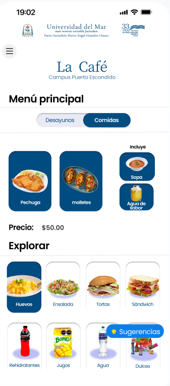
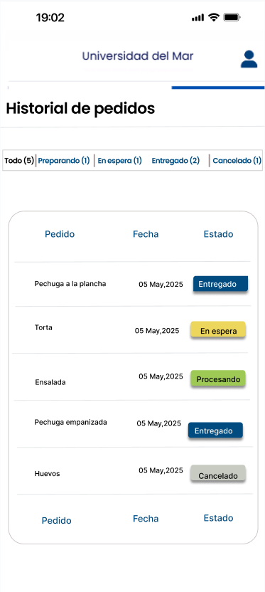

# ☕ Sistema Web para *La Café* - Universidad del Mar

Bienvenido/a al sistema web de **La Café**, una plataforma desarrollada para mejorar la experiencia de estudiantes, docentes y personal en la cafetería de la **Universidad del Mar**.  
Con este sistema puedes:

- Consultar el menú del día 🍽️  
- Realizar pedidos personalizados 🧾  
- Registrar nuevos platillos 👩‍🍳  
- Enviar sugerencias y calificaciones ✍️

> ✨ Creando soluciones tecnologicas para la comunidad universitaria del Mar.

## 🎯 Objetivo

Ofrecer una herramienta digital intuitiva, visual y funcional que facilite el proceso de atención y pedidos en la cafetería universitaria, mejorando la interacción entre el usuario y el equipo de cocina.

## 🚀 Funcionalidades

- 🔐 Registro e inicio de sesión de usuarios
- 📋 Visualización del menú clasificado (desayunos, comidas, bebidas)
- 🧾 Realización de pedidos personalizados
- 🗣️ Envío de sugerencias y calificación del servicio
- 🔄 Gestión de pedidos con estados: `Preparando`, `Entregado`, `En espera`, `Cancelado`
- 🛍️ Carrito de compras y confirmación de pedidos
- 🕓 Historial de pedidos con filtros por estado
- 🔐 Recuperación segura de contraseña

## 🖥️ Descripción de pantallas y flujos

### ✅ Inicio / Bienvenida
- Muestra bienvenida al usuario y botones:
  - **Iniciar sesión** → redirige al login.
  - **Registrarse** → redirige al formulario de registro.

### 🔐 Inicio de sesión
- Campos: correo electrónico, contraseña.
- Botones:
  - **Iniciar sesión**: valida credenciales y redirige al menú principal.
  - **¿Olvidaste tu contraseña?**: redirige a recuperación.
  - **¿No tienes cuenta? Regístrate aquí**: va a registro.

### 🔁 Restablecer contraseña
- Flujo:
  - Ingresar correo institucional.
  - Recibir enlace o código de verificación.
  - Ingresar nueva contraseña y confirmarla.
  - Confirmar actualización y volver al login.

### 📝 Registro de usuario
- Campos:
  - Nombre completo
  - Correo institucional
  - Contraseña / Confirmar contraseña
- Botón: **Crear cuenta**
- Validación de errores y redirección automática tras éxito.

### 📋 Menú principal
- Selector de tipo de comida:
  - **[Desayunos] [Comidas]**
- Secciones:
  - **Menú del día**: platillos destacados con precio e “incluye”.
  - **Explorar**: lista horizontal de snacks y bebidas.
- Al seleccionar un platillo → se muestra una pantalla de especificación.

### 💬 Modal de sugerencias
- Abierto desde botón “Sugerencias”.
- Componentes:
  - Campo de texto
  - Calificación (1-5 estrellas)
  - Botón "Enviar"
- Muestra mensaje de confirmación y cierra modal.

### 🍽️ Especificación de platillos
- Pantalla con detalles del platillo seleccionado.
- Opciones de complementos.
- Botones:
  - **Agregar al carrito**
  - **Confirmar pedido**

### 💳 Confirmación de pedido
- Campo: monto con el que pagará.
- Muestra total, cambio estimado.
- Botones:
  - **Atrás**
  - **Continuar compra**

### 🛍️ Carrito de compras
- Lista de productos seleccionados:
  - Modificar cantidad
  - Eliminar producto
  - Guardar para después
- Botón: **Continuar compra** → método de pago.
- Si está vacío, muestra mensaje de carrito vacío.

### 📦 Mi pedido / Historial de pedidos
- Tabla con:
  - Platillo
  - Fecha
  - Estado (`Entregado`, `En espera`, `Procesando`, `Cancelado`)
- Barra de filtros por estado.
- Contador por categoría.
- Actualización dinámica según filtro seleccionado.

## 🛠️ Tecnologías utilizadas

- HTML5  
- CSS3  
- JavaScript  
- Bootstrap 5  
- jQuery

## 📁 Estructura del proyecto
/la-cafe
│
├── index.html                     # Pantalla de bienvenida

├── login.html                     # Inicio de sesión

├── registro.html                  # Registro de usuarios

├── menu.html                      # Menú principal

├── pedidos.html                   #Especificacion del pedido 

├── sugerencias.html              # Modal de sugerencias

├── registrar-platillo.html       # Registro de platillos

├── admin.html                    # Panel administrativo

├── estados.html                  # Estado de pedidos o compras

├── historial.html                # Historial de pedidos del usuario

├── inicio.html                   # Inicio de sesion

├── restablecerContraseña.html   # Recuperación de contraseña
│

├── css/

│   └── estilos.css               # Hoja de estilos principal
│

├── js/

│   └── script.js                 # Scripts generales
│

├── imagenes/

│   └── inicio.png                # Imágenes del proyecto
│

├── .vscode/                      # Configuración del editor

├── .gitattributes                # Config Git

├── README.md                     # Documentación del proyecto

## ⚙️ ¿Cómo usar?

1. Clona el repositorio:
   
   git clone https:[//github.com/La Café](https://github.com/Heriberthou/ProyectoTW.git)
   
Abre el archivo index.html en tu navegador web.

-Abre index.html en tu navegador.

-Explora las funcionalidades:

-Inicia sesión o regístrate.

-Consulta el menú y realiza un pedido.

-Agrega productos al carrito.

-Envía sugerencias.

-Visualiza tu historial de pedidos.

## 📸 Capturas de pantalla

<table align="center">
  <tr>
    <th>Inicio/Bienvenida</th>
    <th>Menú principal</th>
    <th>Historial de pedidos</th>
  </tr>
  <tr>
    <td></td>
    <td></td>
    <td></td>
  </tr>
</table>

👥 Autores:

**Gomez Bolaina Heriberto - Lider del proyecto y desarrollador**  [contacto](heriberto.gomezbolaina@aulavirtual.umar.mx)

**Cortes Perez Ivan Alexander -Desarrollador** [Contacto](ivanalexander.cortesperez@aulavirtual.umar.mx)

**Galvan German Alondra - Desarrollador** [contacto](alondra.galvangerman@aulavirtual.umar.mx) 

**Lopez Cruz Nelida - Desarrollador**  [contacto](nelida.lopezcruz@aulavirtual.umar.mx) 

**Quintas Rojas Abril Azeneth - Desarrollador** [contacto](https://github.com/AbrilAz)

## 🖼️ Créditos de imágenes

Este proyecto utiliza imágenes de terceros (logos, íconos, fondos) con fines meramente ilustrativos y educativos.  

Si decides implementar este sistema, se recomienda reemplazar estas imágenes por recursos propios o con licencia adecuada.

> ⚠️ Las imágenes no están destinadas a uso comercial ni distribución pública sin autorización de sus autores originales.

<footer style="font-size: 0.85rem; text-align: center; line-height: 1.6; padding: 1em;">
  

    <a href="https://github.com/Heriberthou/ProyectoTW.git" target="_blank">
      Sistema Web para La Café – Universidad del Mar
    </a> © 2025 por 
    <a href="https://creativecommons.org" target="_blank">
      Cortes Perez Ivan Alexander, Galvan German Alondra, Gomez Bolaina Heriberto, Lopez Cruz Nelida y Quintas Rojas Abril Azeneth
    </a> está licenciado bajo 
    <a href="https://creativecommons.org/licenses/by-nc-sa/4.0/" target="_blank">
      Creative Commons Attribution-NonCommercial-ShareAlike 4.0 International
    </a>
    
      
      
      
      
    
  

</footer>

